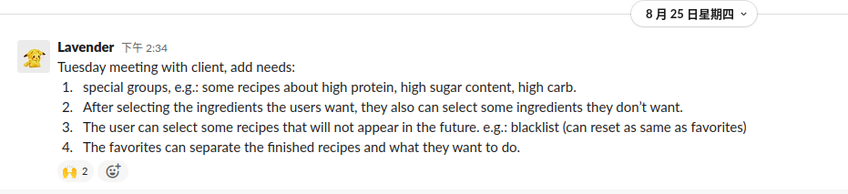

# Lavender Individual Report 
## A clear statement of work done

### week2

#### XP roles:  **tester**

#### weekly plan: 
- Change the course from RE to CC.
- Contact with my groupmates.
- Catch up the group schedule.

#### Actually done:
- Changed successfully from RE12 to CC08.
- Contact successfully with my new groupmates.
- Meeting group members using the zoom on Sunday night 19 p.m. 
- Learned our group project details and current schedule.
- Working together with group members done the scope, deed roll and group contract files.
- Working together with group members prepared the Week3 Project Plan & Roles Allocation Presentation.
- Prepared the question lists for week3 meeting with the client. 

#### Details
In week2, my assigned XP role is tester. But that week is our project’s first week, we haven't produced any output, our work focused on understanding the project, meeting with clients to understand basic requirements, mutual understanding of team members, writing user stories and assignment of project XP roles. Thus, I don’t have any need to do the software testing. I transferred to this project group on Friday that week. I missed meeting with the client for the first time and writing the user stories. But after I joined the group, I immediately contacted the team members and had a meeting with team members that week Sunday.   
[*first contact our group:*]
 
During the meeting, I participated in writing scope, adding my information in contract and deed poll files, and created a new file to compile a list of questions that need to be communicated with the client in week3.   
[*the first meeting with group:*]  
   
[*scope:*]
   
[*contact file:*]
   
[*question list:*]
 
Also, I participated in preparing the Week3 Project Plan & Roles Allocation Presentation including making PPT. 

### Week 3: Demo & poster
#### XP roles: **Demo & poster**
#### weekly plan: 
- Do the Week3 Project Plan & Roles Allocation Presentation.
- Chat with the client about my question list.
- Based on the client requirements modify our scope and user stories.
- Designed the UI/UX.

#### Actually done:
- As the start one done the Week3 Project Plan & Roles Allocation Presentation.
- Chatted with the client about my question list on Tuesday evening.
- Group meeting on Thursday night. 
- Improved our scope and user stories based on the client’s requirements.
- Uploaded the user stories on the Jira. 
- Designed the UI/UX.
- Learning some knowledge about Ios development.
- Proposed to use firebase in our project.

#### Details
In week3, I was assigned to a demo & poster role. During the tutorial, our group did one presentation to introduce our project’s basic information and each group member's role. As I was the demo & poster, I was the first one to introduce during the presentation and I am responsible for introducing the responsibilities of each team member. As always, we had a meeting with the client on Tuesday. During this meeting, I contributed to ask some more detailed questions about the client’s requirement using my prepared question list before. During this meeting, we learned more about the client's requirements.   
[*meeting with client:*]    
  
Thus, in Thursday's group meeting, we improved our scope and user stories based on requirements modified. Then I and Lawrence uploaded all our user stories to the Jira board.  
[*user story modified:*] 
    
[*jira:*]
  
That week, during the group meeting, our group members designed the UI/UX together. Firstly, we planned to use Figma to draw the UI together, but we found this to be inefficient. Because each group member used different tools to draw UI before, we are not familiar with Figma. Then, we decided to draw the UI/UX draft on the whiteboard together and then Andrew is responsible for rendering the sketch on the Figma. I contributed to participating in designing processing and used my previous front-end developing experience to recommend some components design.  
[*UI/UX design:*]  
 
Because I was focused on web development before, I haven’t learnt or tried to develop an iOS app. Thus, I need to learn some ios developing knowledge and need to prepare the ios developing environment. In week3, I tried to research how to develop an ios app on the Windows or Ubuntu system because my laptop systems are them.  Finally I found that I must use MacOS to do the development.  
And in week3, I researched a lot and recommended using firebase in our project. Firebase provides detailed documentation and cross-platform SDKs to help us develop and ship apps on iOS. It is a platform for creating mobile and web applications.   
[*firebase:*]
 

### Week 4: Reporter writer
#### XP roles: Reporter writer

#### weekly plan: 
- Chatting with clients about our designed UI/UX.
- Assign development tasks within the group.
- Learning iOS develops knowledge.

#### Actually done:
- Demonstrated with the client about our design. 
- During the meeting with the client, I recorded the client's feedback.
- Improved our scope and user story.
- Modified the user story on Jira.
- Wrote the progressive report.
- Leant some knowledge about iOS development.
- Set up the coding environment.

#### Details:
As the reporter writer, in week4, I wrote the progressive report and recorded the individual report requirements and shared them with group members.  
[*progressive report:*]  
  
[*individual report requirements:*]  
  
This week, our group goals are demonstrating the UI/UX design with clients and from feedback to improve our design. We met the client on Tuesday, from the meeting, our design approved majority, but added four more requirements. I recorded the client’s requirements and shared them in our slack channel.  
[*meeting record:*]  
    
We have improved our scope documentation and user stories as customer needs change.  
[*user story:*]  
  
And this week, we found that our Jira board writing method is not suitable for our project. Because we will design and write code about the front-end first and then link the database and write logic on the back-end part. Thus, we thought that our task needed to separate the UI and logic part. I and Andrew modified our Jira content.   
[*Jira*]  
    
During week4, I rented a mac computer and installed the environment needed for development, including downloaded xcode, linked the BItbucket, set up the firebase and so on. And this week, I found a course in Stanford teaching iOS development. I looked at some lectures to learn how to write swift and how to develop an ios app.    
[*coding environment:*]  
  
[*Stanford course:*]  
  

## The extent of the work
### Technical part
- In week3, during the group meeting, we all together drew the UI/UX design on the whiteboard. And these designs are all approved by the client during the week4’s client meeting.     
[*UI/UX draft:*]    

- After week4’s client meeting, based on the client’s new requirements, we needed to add four more functions in our application. Thus, we worked together to improve our UI/UX design in the meeting and showed them to the client. Finally, all current requirements UI/UX designs are all approved by the client and we can start to code developing.      
[*UI/UX:*]  

### Non-Technical part
- In the week2, I participated in writing and improving scope, contract, and deep roll files. All these files submitted on the Canvas. The scope file was approved by the client and got the client signed. 
- In the week2, I participated in writing a question list about some details needed to ask for the client in the next week’s meeting with the client. And as the plan all these questions I asked in week3.
- In the week3, I participated in a presentation during the tutorial about each group member's responsibilities. 

## Quality of technical work done
- In order to ensure the smooth progress of iOS software development and avoid problems such as environment incompatibility, all members of the team have prepared a MAC notebook equipped with a MACOS environment.
- We use Apple's official development environment Xcode and official language Swift for application development to ensure that the developed app is suitable for IPHONE mobile phones.  
[*xcode:*]    
  
- We use firebase to simplify the code complexity, achieve a lightweight backend and do not require additional operations such as deploying servers. Also in line with the client's requirements for complete project delivery.  
[*firebase:*]    
    
- We use Jira for project management, clearly showing everyone's tasks, showing what needs to be done, what's in progress, and what's done.  
[*Jira*]  
    
- We use Bitbucket for code management, and each team member writes code in their own branch. Then through the meeting everyone reviews code and then merges to the main branch to ensure code quality and no conflict situation.  
[*Bitbucket:*]

## Other contributions to group processes
- Much of our team's projects so far have been done by everyone, by brainstorming and co-designing or writing documentation.
- All of our current meetings are attended by the whole house and no one is absent.
- Everyone in our group is actively in contact, we solve problems together, and are very active in Slack app.
- The workload of each team member so far may be different, that is because our project has just started and everyone is good in different directions. In the future development and testing activities, everyone will work hard to do their part. All tasks assigned are the result of a joint discussion.

