# Lavender Individual Report (week5 - week8)

## A clear statement of work done

### Summary of Work Done 
- **Brief Summary of XP roles**  

| Week | Work Planned |
|----------|:-------------:|
| week 5 | Tracking & Manager |
| week 6 | Tester |
| week 7 | Customer Liaison |
| week 8 | Tester | 

- **Technical tasks and roles**  
    - **week 5**  
        In the week 5, as the role of tracking and managing XP, I created a project on the Zentao platform to facilitate the documentation of functional tests. Then I learned something about functional testing and learned how to use the Zentao platform. Finally I wrote some test cases for functional tests.

    - **week 6 and week7**  
        From the week 6 to week 7, as the role of tester in week 6 and the role of Customer Liaison, I finished writing all the test cases for function testing on the Zentao platform. And do some research on how to do the other testing in our project. 

    - **week 8**  
        In the week 8, as the role of tester, I was supposed to start doing testing such as unit testing. But I finished the “like” feature this week because the base feature for our group had not yet been implemented.

- **Other responsibilities**
    - **week 5**  
        In the week 5, act as a tracker and manage the XP role. It was my responsibility and duty to call the group to meet, record the meeting, assign tasks and work with everyone to complete them. Therefore, during the week, I contributed to documenting the task requirements for week 5, called the meeting, prepared before the meeting, wrote three meeting minutes including one meeting with the client and two meetings with our group, wrote the to-do list, assigned tasks to each member and did the section on testing both when writing the report and when doing the presentation, and finally completed the 360 degree contribution review.

    - **week 6**   
        In week 6, in my role as a tester, I completed the section of the group report and presentation on testing. I also prepared for the presentation with the client in week 7 by making the PPT slides on the testing part and preparing the presentation transcript on the testing part. 

    - **week 7**  
        In week 7, my role as Customer Liaison, I contacted the client a week in advance of the meeting to set up a time and address for the presentation about the week. During the presentation, I made a recorded contribution. And after the meeting with the client, I compiled and recorded the feedback from the client. Also I contributed in writing the group contract from week 6 to week 13. 
        
    - **week 8**  
        In week 8, my role was that of a tester, but I contributed to the group by contacting customers and writing the progressive report. I contacted the client and offered to suspend a client meeting because there was no new intuitive page functionality available to her at the moment. And I started preparing and writing our progressive report.

### Weekly Plan
| Week | Work Planned | Work Completed |
|----------|:-------------|:------|
| week 5 | <li> Write the group report. <li> Write the individual report. <li> Prepare the presentation. <li> Show the current process to the client. | <li> Finished the group report. <li> FInished the individual report <li> FInished the presentation slides. <li> Recorded the presentation <li> Met a client and got feedback. <li> Researched and learnt something about testing. <li> Set the function testing platform. <li> Wrote some test cases for function testing. <li> Recorded three meeting minutes <li> Finished the to-do list.|
| week 6 | <li> Do the in-tutorial presentation. <li> Prepare the client demo. <li> Write test cases for function testing. | <li> Finished the in-tutorial presentation. <li> Prepared the client demo. <li> Finsihedc the demo slides. <li> Finished writing test cases for function testing. <li> Finished the group contract file for week 6 to week13. |
| week 7 | <li> Do the presentation with the client. <li> Plan to meet the client and get feedback. | <li> Finished the presentation with client. <li> Met the client and got feedack. <li> Recorded the presentation. <li> Compiled and recorded the feedback from the client. <li> Contributed in writing the group contract |
| week 8 | <li> Write the "like" feature. | <li> Finished the "like" feature. <li> Contacted with the client to update our progress. <li> Prepared the progressive report.|

## The extent of the work
### week 5
As the Tracking & Manager, during the tutorial, I contributed in recording the week5 tasks requirements and shared them with my group on Slack.   
[*week5_requirements*]    
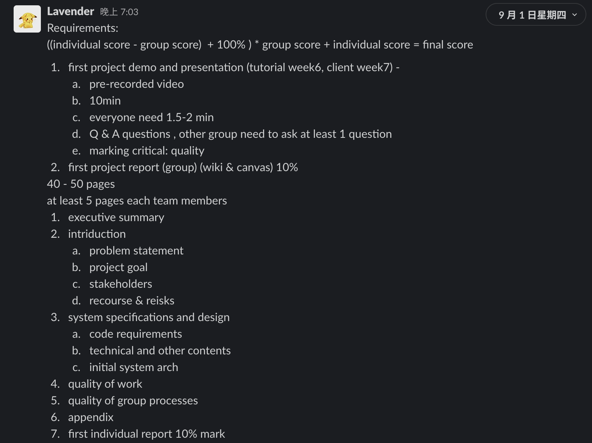 

As the manager, before the meeting, I contributed in making some preparations including declaring the group meeting content and creating the file on the google drive to let our group work together.  
[*meeting_preparations*]    
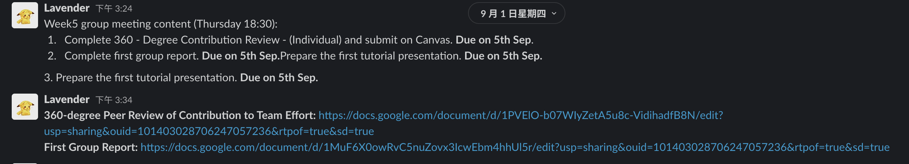 

As the manager, I contributed in writing the week5' wiki and recording three meeting minutes including one meeting with the client and two meetings with our group. During the meeting with the client, we showed our progress and got feedback from the client that all is well done but we need to show more features in the next meeting. During our first group meeting, we assigned each member tasks about group report and presentation and then wrote the group report together. During the second group meeting, we finished our presentation slides and recorded the presentation.    
[*wiki*]    
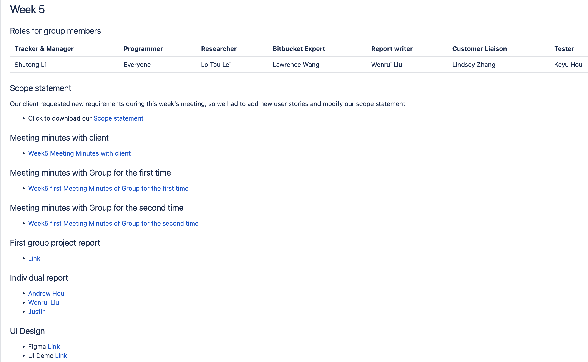   

[*client_minutes*]    
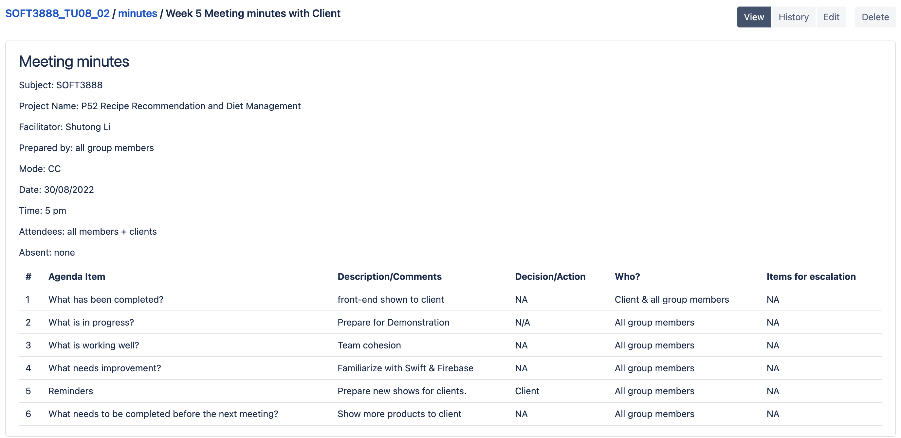   

[*first_group_minutes*]    
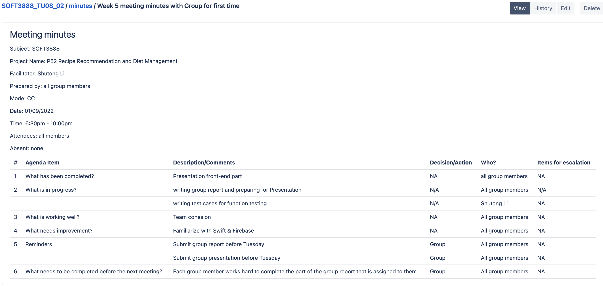   

[*second_group_minutes*]    
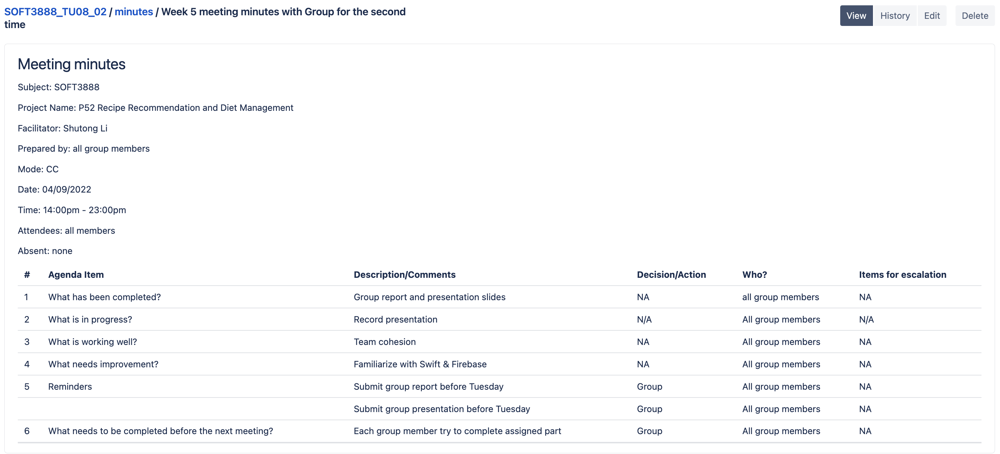   

During the first group meeting, we discussed this week’s tasks and assigned them to each group member. As the manager, I contributed in writing the to-do list posted on Slack.  
[*to_do_list*]    
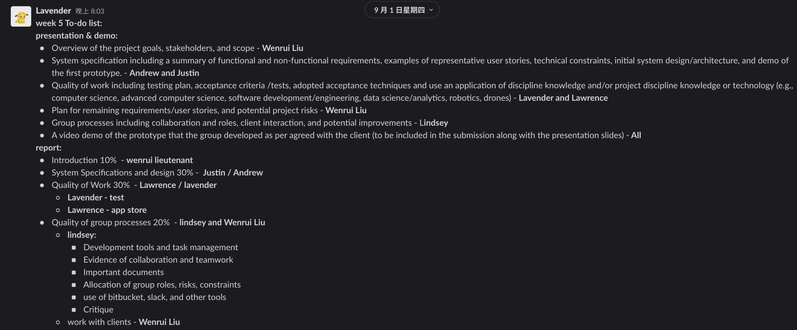  

And the manager, I contributed in creating a new project and set up the function testing environment on the Zentao platform and then wrote some test cases. On the Zentao platform, I can create each test case clearly. It includes each test case running prerequisite, the test cases belonging to which modules, the testing type, the priority, the test case current status and so on information. And It shows each step clearly, when executing the test case, can directly record the result when clicking the “run” button. It can record each step's running result such as “pass”, “fail”, “blocked” and so on.  
[*zentao*]    
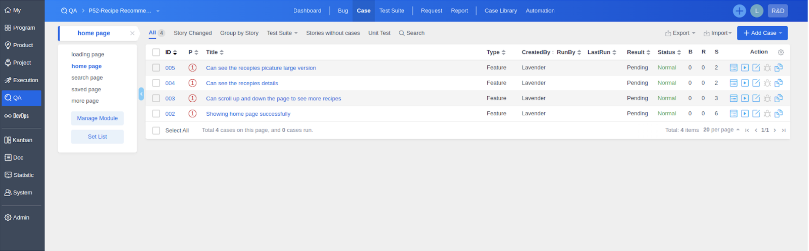  

[*zentao_details*]    
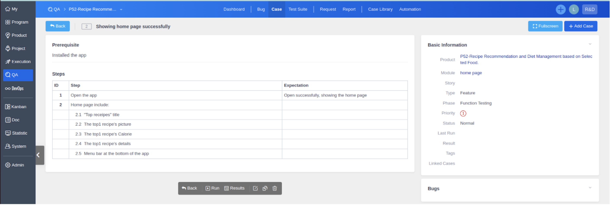  

As a group member, I contributed in researching and learning some knowledge about testing and finishing all parts about testing in the group report.  
 [*group_report*]    
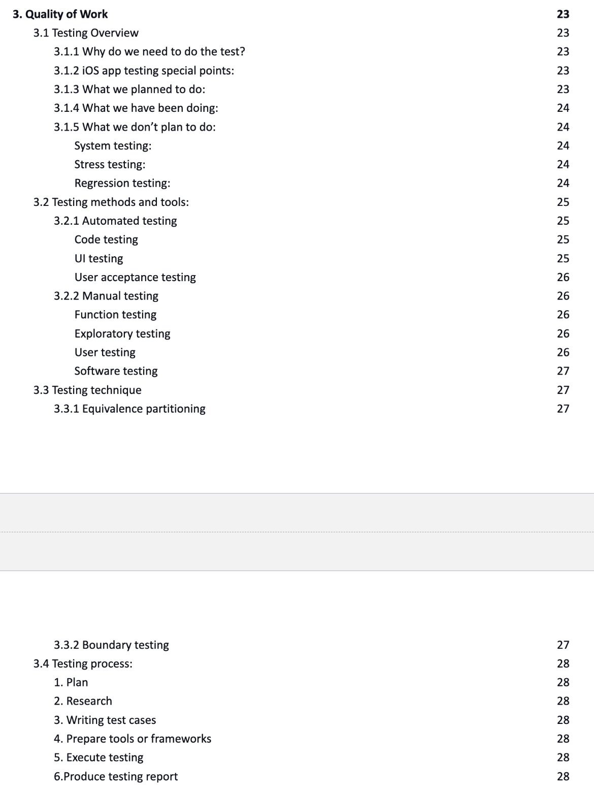 

And I am also responsible for the testing part of the presentation. Thus, I contributed in finishing the presentation slides about testing and recording the representation.    
 [*presentation_slides_1*]    
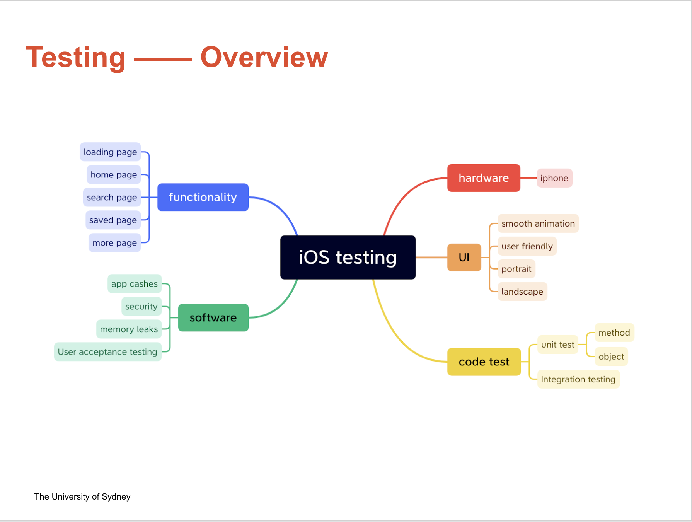 

 [*presentation_slides_2*]    
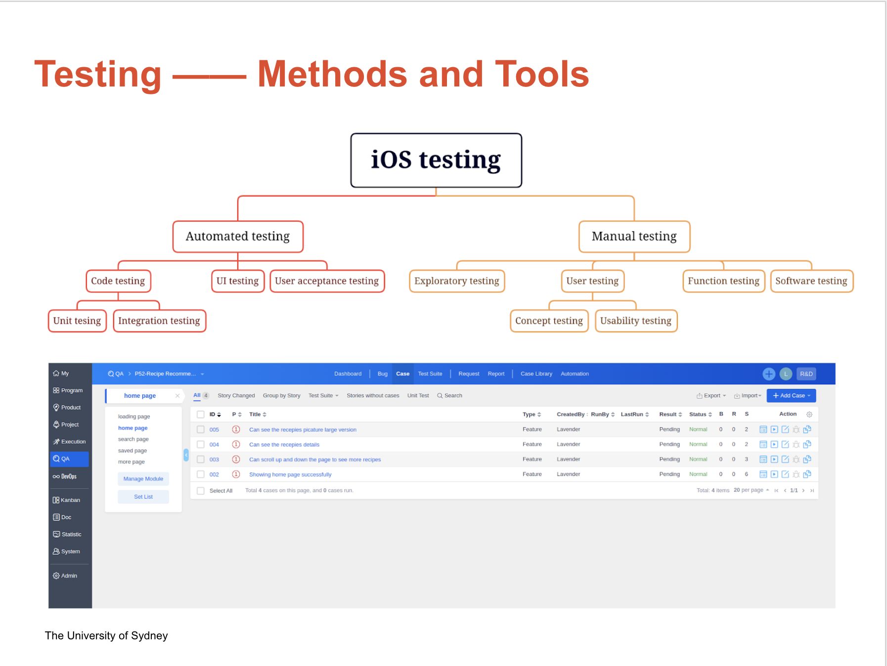 

 [*presentation_slides_3*]    
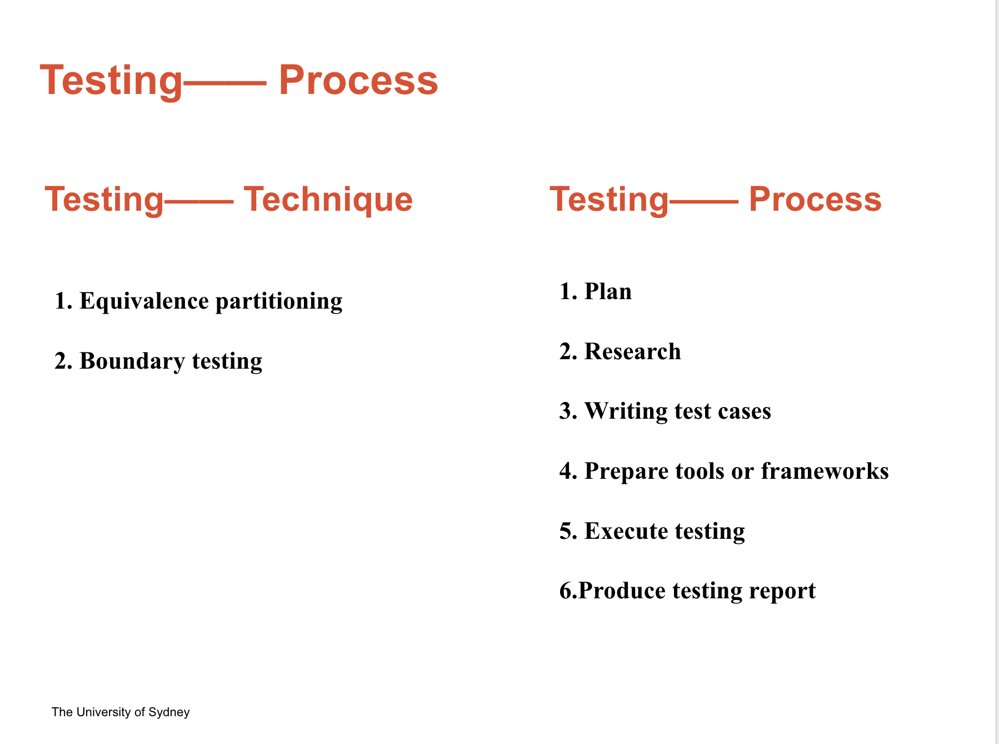 

### week 6

### week 7

### week 8

## Quality of technical work done

## Other contributions to group processes

