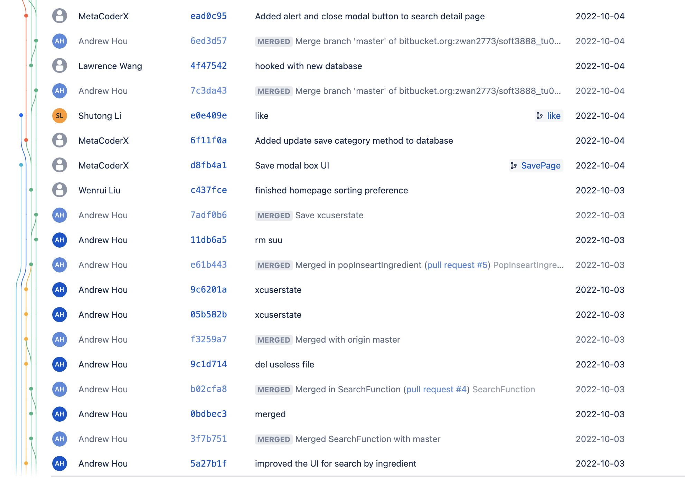
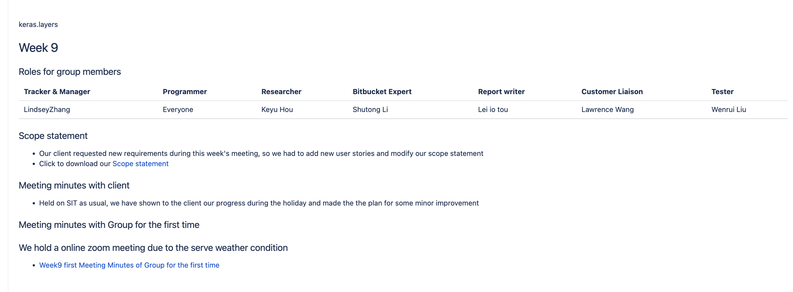
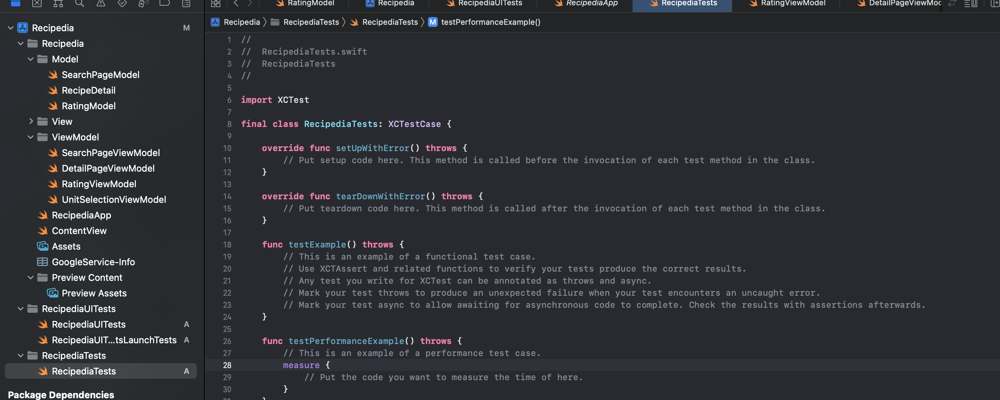
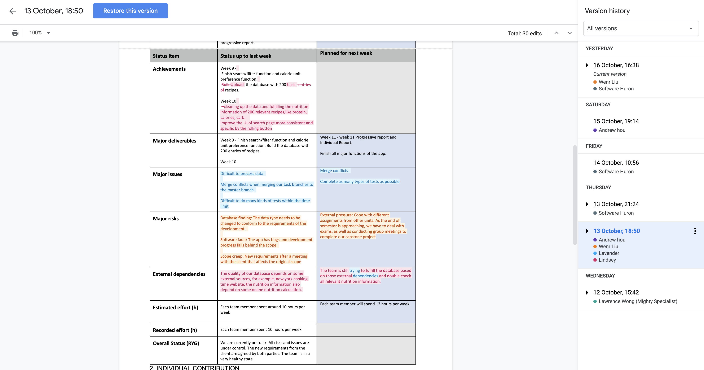
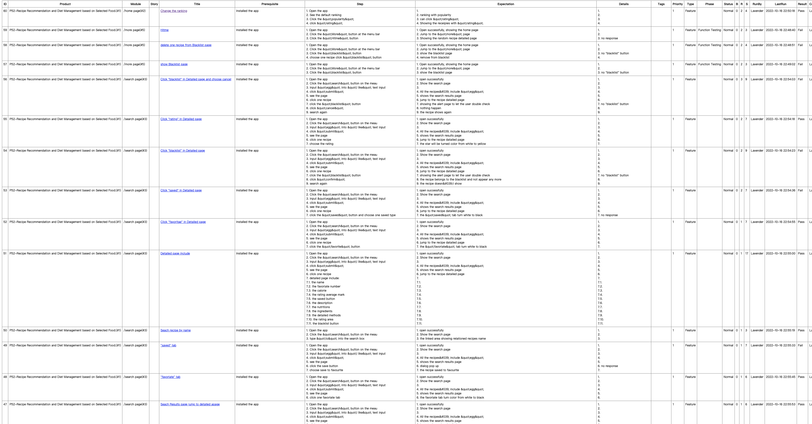
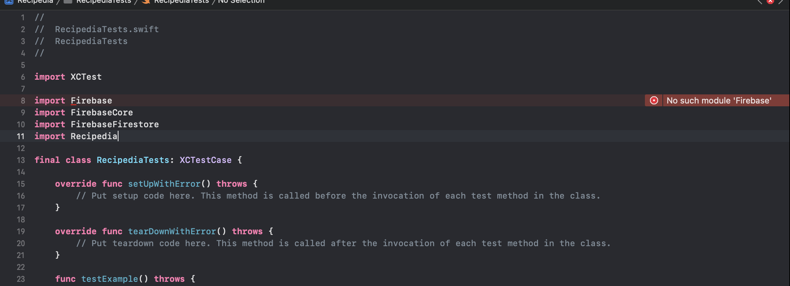
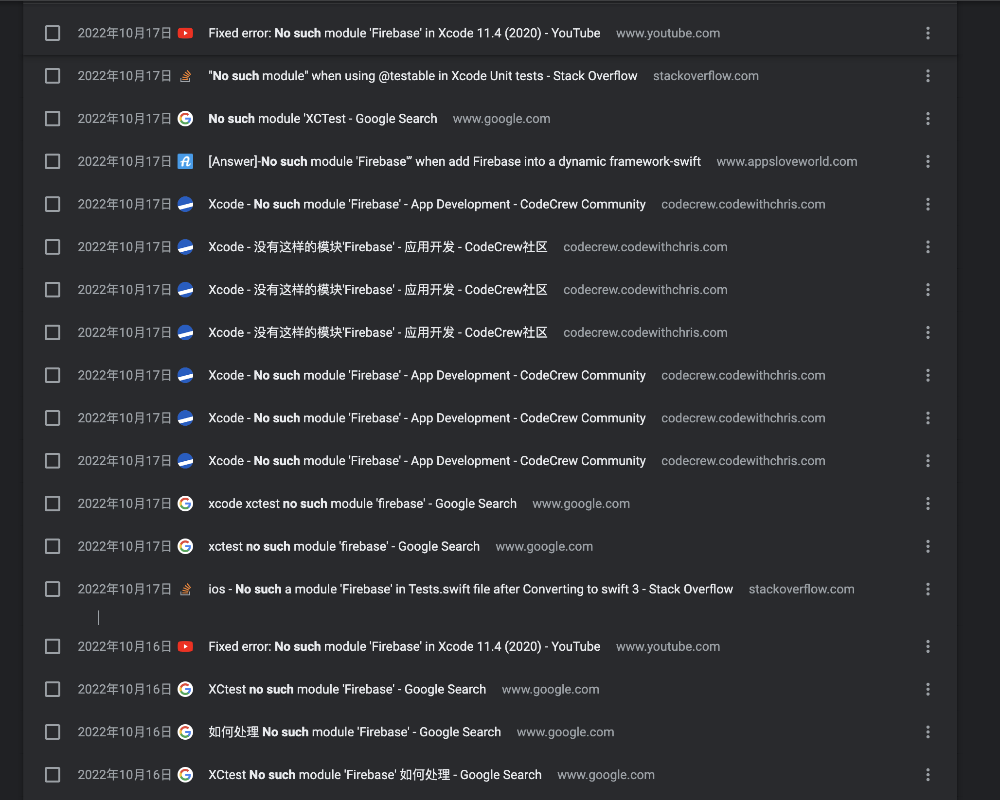
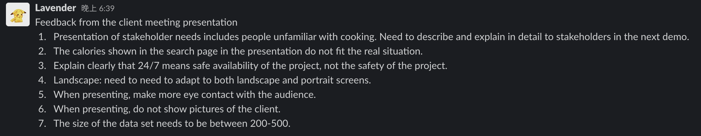

# Lavender Individual Report (week9 - week10)

## A clear statement of work done

### Summary of Work Done 
- **Brief Summary of XP roles**  

| Week | Work Planned |
|----------|:-------------:|
| week 9 | Bitbucket Expert |
| week 10 | Report writer |

- **Technical tasks and roles**  
    - **week 9**   
        In week 9, my role was that of a Bitbucket expert, and to avoid code conflicts, I created a new branch in Bitbucket and submitted my code for the "like" function. As the project team member, I set up the project unit testing environment.

    - **week 10**  
        In week 10, my role was that of report writer, and I assembled and worked with my teammates to complete the week11 progressive report. As a team member, I completed the first round of functional testing, testing a total of 55 test cases, passing 33 and failing 22. The reason for this was that our development was not complete and some of our code had not been code reviewed and therefore had not been merged into the master branch. Also I tried to write unit testing but failed.

- **Other responsibilities**
    - **week 9**  
        In week 9, my role was that of Bitbucket expert, and I followed the Bitbucket commit process to make sure our project had no code merge conflicts. I participated in a tutorial class on Tuesday, where we worked on code review and merging. And I supervised the person in charge to finish the wiki for week 9.

    - **week 10**   
        In week 10, my role was that of report writer, I finished the week11 progressive report together with group members. And I generated a test report including the first functional testing test cases including each test case's name, testing steps, the result and so on. As a team member, I researched how to write XCtest.

### Weekly Plan
| Week | Work Planned | Work Completed |
|----------|:-------------|:------|
| week 5 | <li> Plan to monitor Bitbucket process. <li> Plan to finish and submit the “like” function. | <li> Monitored Bitbucket process and ensured there is no merge conflict. <li> Finished and submitted the “like” function. <li> Setup the project unit testing environment.|
| week 6 | <li> Plan to write progressive report. <li> Plan to do functional testing. | <li> Finished progressive report. <li> Finished the first time functional testing. <li> Generated the first testing report for functional testing. <li> Researched on how to write XCtest. <li> Tried to write unit testing. |

## The extent of the work
### week 9
As a bitbucket expert, in week 9 I oversaw the processing of commits and avoided merge conflicts. We merged a total of two times. Once on Monday of week 9, the last day of the midterm break, and the second time on Tuesday during tutoring session and before the client meeting. We merged the code we wrote over the holidays. I was the bitbucket expert to make sure there were no conflicts.  
[*Bitbucket_commit:*]   
  

As part of the project team, I completed and committed the code for the "like" feature. As a Bitbucket expert, I chose to create a new branch and then commit the code in the new branch to avoid code conflicts.  
[*My_commit:*]   
  

As a Bitbucket expert, I made sure that our week 9 wiki was complete and that the roles of the project members were correct.  
[*Wiki:*]   
  

As part of the project team, I set up the unit testing environment. First I chose a new target belonging to the “Unit Testing Bundle”, and then I initiated the parameters for our project.
[*Unit_testing:*]   
  

### week 10
As the report writer, I assembled and worked with the rest of the project team to complete the week11 progressive report.
[*Progressive_report:*]   
  

As a group team member, in the ninth week, I did the first functional test, because our project was modified during the actual development process and the original design, so I first cut our use case before testing and Edit, in the end, I actually tested 55 test cases, 33 passed, and still 22 are currently showing results that are not as expected, because our development is not complete, and there is a part of the code that has not been merged into the master branch.
[*Test_report:*]   
  
Here are the raw file:  
[P52-Recipe Recommendation and Diet Management based on Selected Food.-first function test-Case.html](./week10/P52-Recipe%20Recommendation%20and%20Diet%20Management%20based%20on%20Selected%20Food.-first%20function%20test-Case.html)  
Or  
[P52-Recipe Recommendation and Diet Management based on Selected Food.-first function test-Case.csv](./week10/test.csv)  

As part of the project team, I tried to write the unit testing for our project. But I failed in the import module, it always told me that “no such module..”. I researched a lot but still now haven’t handled this problem. 
[*Unit_testing:*]   
  
[*Research_bug:*]   
  

## Quality of technical work done
I contributed to chosing to use zentao platform to ensures that our function testings are complete and viewable. On the Zentao platform, I can create each test case clearly. It includes each test case running prerequisite, the test cases belonging to which modules, the testing type, the priority, the test case current status and so on information. And It shows each step clearly, when executing the test case, can directly record the result when clicking the “run” button. It can record each step's running result such as “pass”, “fail”, “blocked” and so on    
[*quality_zentao*]    

I contributed to choosing to use Equivalence partitioning and Boundary testing two methods to ensure that our test cases coverage is good. For example, we write a test case where some boundary value that the input node must at least exist one. Using these techniques can improve our test cases quality and can make our test cases more comprehensive and complete in design.  
[*quality_method*]    

## Other contributions to group processes
I contributed to attending meetings every time. I have not missed a group meeting or meeting with a client. And I contributed to recording feedback from every meeting with clients.   
[*feedback*]    

I contributed to completing assigned tasks on time and responding to messages promptly. For example, I was assigned to send an email to the client, then I will finish immediately. And when other members need some, I will reply and provide quickly.
[*on_time*]    

[*on_time*]    

I contributed to using my experience to help our project in the testing part. I have some software testing experience before but they are not iOS application related. Thus, I also need to do some research on iOS testing. But compared to our group members, I may be more familiar with the testing, then in group report, presentations, I did the testing part. And I was assigned the XP roles as the tester more frequently. 
[*group_contract*]    

